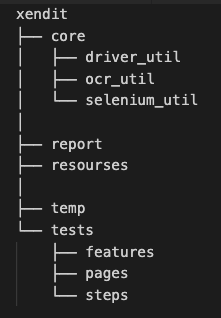

## Tools & Technology
>Programming Language: Python 3.9
>
>Web Driver: Selenium
>
>Web Driver Version Management: webdriver_manager
>
>BDD: Behave
>
>OCR: gpyocr
>
>Dependencies management: Pipfile
>
>Design pattern: POM

## Download a Framework
Automation Test Framework: https://github.com/pnthieuvn/xendit

Test Cases: https://docs.google.com/spreadsheets/d/1V5JYUrgZVaaA5QcVJ85bYJQrO9_N1bRCQ3XhC-E-QOU/edit?usp=sharing

## Code Structure

**core:** Core Framework will be developed here

>**core/driver_util:** 
- Initialize Web Driver: Support Chrome, Firefox.
- Manage driver version by DriverManager
- Get Web Driver
- Web Driver actions: Close Driver

>**core/selenium_util:** 
- Element Util is a wrapper of Selenium to prevent tricky issue such as: Timeout, loading

>**core/ocr_util:** 
- Scan image then return as string

>**resources/constants:** 
- Constant values, test data

>**tests:** 
- Automated test case will be developed here

>**tests/pages:** 
- Page classes in POM, using to initialize locators and define locator actions

>**tests/steps:** 
- Steps definitions in POM, using to define test step, assertion and mapping with BDD step by behave annotation given, when, then

>**tests/features:** 
- BDD feature file. Using to develop BDD test scenario

**tests/environment.py:** 
- Setup/Teardown scripts for BDD step. We can define Setup/Teardown for each level in BDD: before_all, after_all, before_feature, after_feature, before scenario, after_scenario, before_step, after_step

**behave.ini:** 
- Setting for Behave

**Pipfile:** 
- Manage dependencies. To install dependencies just run below command: pipenv install (--skip-lock)

## Set up test environment
### Installation
The test framework is running against Python 3, please make sure you have Python 3.7 (or above) and Pip3 installed on your computer. Once you create a local copy from this rep. Please follow installation steps as below:

You need to install tesseract to use OCR for Canvas value scanning:
> **OS X:** brew install tesseract
> 
> **Windows:** download binary from https://github.com/UB-Mannheim/tesseract/wiki. then add pytesseract.pytesseract.tesseract_cmd = 'C:\Program Files (x86)\Tesseract-OCR\tesseract.exe' to your script.

You need to use allure command-line to resolve allure results and present test report in browsers, you can install it with Homebrew
> brew install allure

Install dependencies from Pipfile
> pip install pipenv
> 
> pipenv install

To develop your test cases, you may choose PyCharm(Recommended!) as your IDE
> Go to Preferences > Project Interpreter > Add > Pipenv Environment > Ok
> 
> (refer https://www.jetbrains.com/help/pycharm/pipenv.html for more details)

## Writing a test
We develop Test Case following POM x BDD:
1. Develop locators in tests/pages/page_class
2. Develop step definitions in test/steps/step_class
3. Write BDD scenarios in test/features/feature_file

## Run test cases
This test framework is using Behave which supports several ways to run and select tests from the command-line.

### Setup Browser Driver version
This test framework using webdriver_manager to manage the browser version. By default this test framework will run on the Chrome browser and install the latest chrome driver. 

If you want to run with specific chrome driver version, please set below value:

>**resources/constants: CHROME_VERSION=<CHROME_VERISION_VALUE>**

### Run all tests
> pipenv run behave

### User define parameters
To use User define parameters, please refer to below syntax:
> pipenv run behave -D <parameter_name>=<parameter_value>

We support below user define parameters:
> screenshot: failed/passed. Take screenshot then attach into Allure Report when test step failed/passed. By default screenshot=failed.
> 
>e.g:
> pipenv run behave -D screenshot=passed

> clear_temp: True/False. Clear captured screenshots for OCR in the ./temp folder. By default clear_temp=True.
> 
>e.g:
> pipenv run behave -D clear_temp=False
### Filter by tag
> pipenv run behave --tags=<tag_name> 
> 
> e.g: pipenv run behave --tags=single-operator. Behave will run scenarios having @single-operator only

## Open report
> pipenv run open_report
